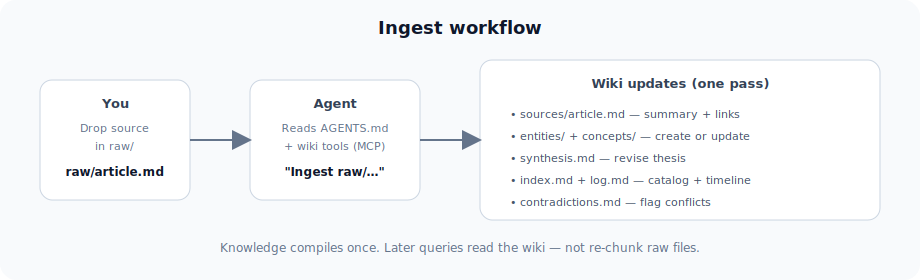
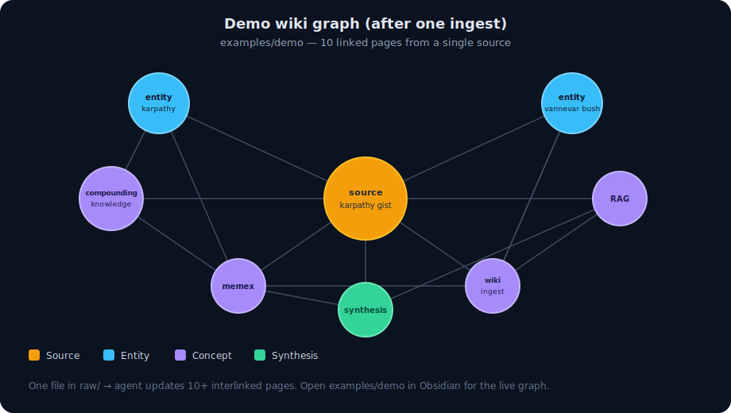

# LLM Wiki

[](https://github.com/cobusgreyling/llm-wiki/actions/workflows/ci.yml)
[](https://pypi.org/project/llm-wiki/)
[](LICENSE)


A **reference implementation** of [Andrej Karpathy's LLM Wiki pattern](https://gist.github.com/karpathy/442a6bf555914893e9891c11519de94f) — a compounding personal knowledge base where the LLM maintains structured, interlinked markdown instead of re-deriving everything from raw chunks on every question.

> *"Obsidian is the IDE; the LLM is the programmer; the wiki is the codebase."*

## Use this template

This repo is a [GitHub template](https://github.com/cobusgreyling/llm-wiki/generate). Click **Use this template** → create your repo → then:

```bash
pip install llm-wiki
wiki init my-wiki --git
cd my-wiki
wiki init-check
```

Or install the toolkit only and scaffold locally:

```bash
pip install llm-wiki
wiki init my-wiki --git
```

## Why not RAG?

Classic RAG retrieves fragments at query time. Nothing accumulates. Ask a question that synthesizes five documents and the LLM rediscovers the pieces every time.

**LLM Wiki is different.** When you add a source, the agent reads it, extracts key information, and integrates it into a persistent wiki — updating entity pages, revising synthesis, flagging contradictions. Knowledge is **compiled once and kept current**.

| | RAG | Notes app | LLM Wiki |
|---|-----|-----------|----------|
| **Knowledge accumulates** | No — re-retrieve each query | Manual linking | Yes — agent integrates on ingest |
| **Cross-document synthesis** | Fragment assembly at query time | You connect the dots | Pre-built in synthesis + entity pages |
| **Citations** | Chunk references | None by default | Wikilinks to source pages |
| **Agent role** | Retrieve + answer | None | Maintain the wiki (ingest, lint, update) |
| **Human role** | Curate corpus | Write everything | Curate `raw/` + ask questions |

## See it in action

**Ingest flow** — one source update touches the whole wiki:



**Demo graph** — two sources link to 15+ pages ([`examples/demo/`](examples/demo/)):



### From a repo clone

> **Note:** This repository is the **toolkit**, not a wiki root. Example wikis live under `examples/`. Always pass `--root` or use `make` shortcuts:

```bash
git clone https://github.com/cobusgreyling/llm-wiki.git
cd llm-wiki
pip install -e ".[dev,mcp]"

make demo-search          # wiki --root examples/demo search "memex"
make demo-ingest          # ingest status
./scripts/demo-walkthrough.sh   # full terminal tour
```

Open `examples/demo/` as an Obsidian vault to explore the live graph.

## Quick start

### 1. Install

```bash
pip install llm-wiki
pip install "llm-wiki[mcp]"   # optional: MCP server for agents
```

### 2. Scaffold a new wiki

```bash
wiki init my-wiki --git
cd my-wiki
wiki init-check
```

This creates agent configs (`.cursor/mcp.json`, `.mcp.json`, `CLAUDE.md`) with paths already set.

### 3. Open in your agent

Point Claude Code, Cursor, Codex, or any agent at the wiki folder. The agent reads **`AGENTS.md`** and becomes your wiki maintainer.

#### Cursor

MCP is pre-configured at `.cursor/mcp.json` after `wiki init`. Reload MCP servers in Cursor settings, then try:

> "Lint the wiki" or "Search the wiki for transformer architecture"

#### Claude Code

`CLAUDE.md` points to `AGENTS.md`. MCP is in `.mcp.json`:

```bash
cd my-wiki
claude   # or your Claude Code entrypoint
```

### 4. Add a source and ingest

```bash
cp ~/Downloads/some-article.md raw/
wiki ingest-status    # confirm pending raw files
```

Then tell your agent:

> "Ingest the new source in raw/"

### 5. Browse in Obsidian

Open the wiki folder as an Obsidian vault. Watch the graph grow as your agent maintains cross-references in real time.

## Architecture

```
my-wiki/                  # your project (from wiki init)
├── raw/                  # Immutable sources (you curate)
├── wiki/                 # LLM-maintained markdown (agent writes)
│   ├── index.md          # Content catalog — read first on queries
│   ├── log.md            # Append-only operation timeline
│   ├── synthesis.md      # Evolving thesis
│   ├── entities/         # People, orgs, products…
│   ├── concepts/         # Ideas, frameworks…
│   ├── sources/          # Per-document summaries
│   └── answers/          # Filed query responses
├── templates/            # Page templates
├── AGENTS.md             # Agent instructions (the schema)
└── (CLI via pip install llm-wiki)
```

**This repo** ships the toolkit under `src/llm_wiki/`. Populated examples:

| Example | Domain |
|---------|--------|
| [`examples/demo/`](examples/demo/) | Karpathy gist + qmd (with contradiction) |
| [`examples/research/`](examples/research/) | NLP paper notes |
| [`examples/reading/`](examples/reading/) | Book chapter notes |

## Operations

| Operation | Who triggers | What happens |
|-----------|--------------|--------------|
| **Ingest** | You drop a file in `raw/` | Agent creates source page, updates 10–15 linked pages, revises synthesis |
| **Query** | You ask a question | Agent searches index, reads pages, synthesizes with citations |
| **Lint** | You or agent, periodically | Broken links, orphans, contradictions, index gaps |
| **Ingest status** | You or agent, before ingest | Lists raw files missing source pages |

## CLI

```bash
wiki init my-wiki --git                    # scaffold a new project
wiki ingest-status                         # raw ↔ source coverage
wiki search "transformer architecture"       # BM25 (default)
wiki search "auth flow" --backend qmd        # optional: requires qmd collection
wiki list --type concept                   # browse pages by type
wiki lint                                  # health check (exits 1 on errors)
wiki lint --json                           # machine-readable lint output
wiki stats                                 # page counts
wiki log                                   # recent operations
wiki expand synthesis                      # read a page + TOC
```

Set `LLM_WIKI_ROOT` when running the MCP server or CLI from outside the project directory.

### Scale: qmd integration

When BM25 search misses paraphrased queries, add [qmd](https://github.com/tobi/qmd) as a retrieval layer:

```bash
npm install -g @tobilu/qmd
qmd collection add ./wiki --name wiki
qmd embed
wiki search "your query" --backend qmd
```

The wiki pages remain the source of truth; qmd improves recall.

## MCP server

Tools: `wiki_search`, `wiki_expand`, `wiki_list`, `wiki_lint`, `wiki_stats`, `wiki_ingest_status`, `wiki_recent_log`

```bash
pip install "llm-wiki[mcp]"
python -m llm_wiki.mcp_server
```

## Example use cases

- **Research** — papers and articles over weeks, building an evolving thesis → see [`examples/research/`](examples/research/)
- **Reading** — chapter-by-chapter book notes with character/theme pages → see [`examples/reading/`](examples/reading/)
- **Business** — meeting transcripts, Slack threads, project docs
- **Personal** — health, goals, journal entries, podcast notes
- **Due diligence** — competitive analysis that compounds

## Obsidian tips

- **Web Clipper** — clip articles directly to `raw/`
- **Graph view** — see hub pages, orphans, and connections
- **Dataview** — query YAML frontmatter for dynamic tables
- **Marp** — generate slide decks from wiki content

## Related work

- [Karpathy's LLM Wiki gist](https://gist.github.com/karpathy/442a6bf555914893e9891c11519de94f) — the original pattern
- [qmd](https://github.com/tobi/qmd) — local hybrid search when the wiki outgrows the index
- [trip2g](https://trip2g.com/en/user/llm_wiki) — hosted wiki + MCP federation

## Contributing

See [CONTRIBUTING.md](CONTRIBUTING.md). Good first issues welcome — check the issue templates.

Maintainers: see [MAINTAINERS.md](MAINTAINERS.md) for release and PyPI publishing.

## Launch

Ready-to-post announcement copy (gist comment, social, HN): [LAUNCH.md](LAUNCH.md).

Record a terminal demo: [docs/DEMO.md](docs/DEMO.md).

## License

MIT — see [LICENSE](LICENSE).