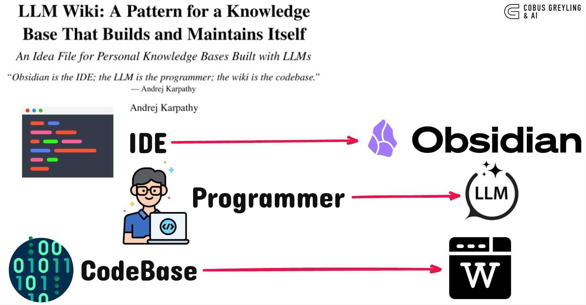

# LLM Wiki



A **reference implementation** of [Andrej Karpathy's LLM Wiki pattern](https://gist.github.com/karpathy/442a6bf555914893e9891c11519de94f) — a compounding personal knowledge base where the LLM maintains structured, interlinked markdown instead of re-deriving everything from raw chunks on every question.

> *"Obsidian is the IDE; the LLM is the programmer; the wiki is the codebase."*

## Why not RAG?

Classic RAG retrieves fragments at query time. Nothing accumulates. Ask a question that synthesizes five documents and the LLM rediscovers the pieces every time.

**LLM Wiki is different.** When you add a source, the agent reads it, extracts key information, and integrates it into a persistent wiki — updating entity pages, revising synthesis, flagging contradictions. Knowledge is **compiled once and kept current**.

## Quick start

### 1. Use this template

```bash
# Use as a GitHub template, or clone directly:
git clone https://github.com/cobusgreyling/llm-wiki.git my-wiki
cd my-wiki
```

### 2. Install the CLI

```bash
pip install -e .
wiki init-check
```

### 3. Open in your agent

Point Claude Code, Cursor, Codex, or any agent at this repo. The agent reads **`AGENTS.md`** and becomes your wiki maintainer.

### 4. Add a source and ingest

```bash
# Drop an article, paper, or notes into raw/
cp ~/Downloads/some-article.md raw/

# Then tell your agent:
# "Ingest the new source in raw/"
```

### 5. Browse in Obsidian

Open the repo folder as an Obsidian vault. Watch the graph grow as your agent maintains cross-references in real time.

## Architecture

```
llm-wiki/
├── raw/              # Immutable sources (you curate)
├── wiki/             # LLM-maintained markdown (agent writes)
│   ├── index.md      # Content catalog — read first on queries
│   ├── log.md        # Append-only operation timeline
│   ├── synthesis.md  # Evolving thesis
│   ├── entities/     # People, orgs, products…
│   ├── concepts/     # Ideas, frameworks…
│   ├── sources/      # Per-document summaries
│   └── answers/      # Filed query responses
├── templates/        # Page templates
├── AGENTS.md         # Agent instructions (the schema)
└── src/llm_wiki/     # CLI + MCP tools
```

## Operations

| Operation | Who triggers | What happens |
|-----------|--------------|--------------|
| **Ingest** | You drop a file in `raw/` | Agent creates source page, updates 10–15 linked pages, revises synthesis |
| **Query** | You ask a question | Agent searches index, reads pages, synthesizes with citations |
| **Lint** | You or agent, periodically | Broken links, orphans, contradictions, index gaps |

## CLI

```bash
wiki search "transformer architecture"   # BM25 search
wiki lint                                # health check
wiki stats                               # page counts
wiki log                                 # recent operations
wiki expand synthesis                    # read a page + TOC
```

## MCP server

Give your agent native wiki tools:

```bash
pip install -e ".[mcp]"
```

```json
{
  "mcpServers": {
    "llm-wiki": {
      "command": "python",
      "args": ["-m", "llm_wiki.mcp_server"],
      "cwd": "/path/to/your/llm-wiki"
    }
  }
}
```

Tools: `wiki_search`, `wiki_expand`, `wiki_lint`, `wiki_stats`, `wiki_recent_log`

## Example use cases

- **Research** — papers and articles over weeks, building an evolving thesis
- **Reading** — chapter-by-chapter book notes with character/theme pages
- **Business** — meeting transcripts, Slack threads, project docs
- **Personal** — health, goals, journal entries, podcast notes
- **Due diligence** — competitive analysis that compounds

## Example wiki

See [`examples/demo/`](examples/demo/) for a starter wiki ingested from Karpathy's original gist, with entity and concept pages already populated.

## Obsidian tips

- **Web Clipper** — clip articles directly to `raw/`
- **Graph view** — see hub pages, orphans, and connections
- **Dataview** — query YAML frontmatter for dynamic tables
- **Marp** — generate slide decks from wiki content

## Related work

- [Karpathy's LLM Wiki gist](https://gist.github.com/karpathy/442a6bf555914893e9891c11519de94f) — the original pattern
- [qmd](https://github.com/tobi/qmd) — local hybrid search when the wiki outgrows the index
- [trip2g](https://trip2g.com/en/user/llm_wiki) — hosted wiki + MCP federation

## Contributing

Fork it, adapt `AGENTS.md` to your domain, and open PRs for tooling improvements. This repo is a **template and toolkit**, not a hosted service.

## License

MIT — see [LICENSE](LICENSE).